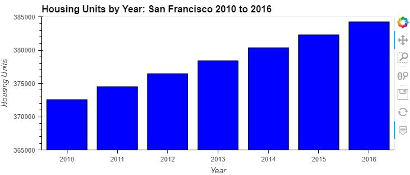
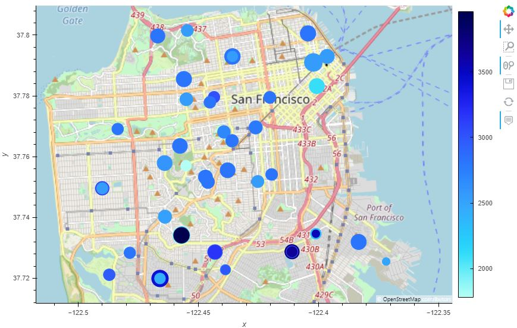

# Module 6 Challenge

This project analyzes housing investment opportunities in the San Francisco area.  Housing units are totaled by year from 2010 to 2016,

along with the sale price per square foot and average gross rent. Data is plotted on interactive maps and analyzed to determine

possible areas to implement a new one-click service to buy and rent properties.

---

## Technologies

This project uses Python 3.9.7 and the following libraries - 
| Library | Version | Documentation
|----|----|---|
| pandas |1.4.2| [pandas docs](https://pandas.pydata.org/docs)
| hvplot |0.8.0| [hvplot docs](https://hvplot.holoviz.org/)


---

## Installation Guide

libraries can be imported with the following code.

```
import pandas as pd

import hvplot.pandas
```
---

## Usage

Interactive visualization was used to help to determine investement opportunities.

|<p align="center">San Francisco Neighborhoods: 2010 to 2016</p>|
|---|
|<p align="center"></p>|

|<p align="center">Housing Units Per Year</p>|<p align="center">San Francisco Map</p>|
|---|---|
|<p align="center"></p>|<p align="center"></p>|


---

## Contributors

Dan McQueen

dandmcqueen@gmail.com

[Linkedin](https://www.linkedin.com/in/dan-mcqueen-4a5980238/)

---

## License

[GNU v3.0](LICENSE)
